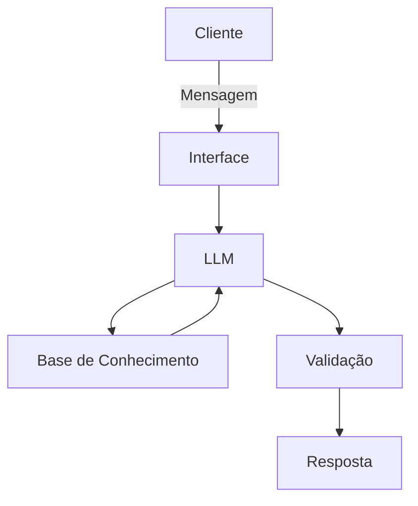

# Documentação do Agente

## Caso de Uso

### Problema
> Qual problema financeiro seu agente resolve?

Muitas pessoas têm dificuldade em escolher produtos financeiros porque não entendem conceitos como risco, liquidez e rentabilidade. Isso gera insegurança e pode levar a decisões inadequadas ou à falta de ação.

### Solução
> Como o agente resolve esse problema de forma proativa?

O agente atua como um assistente financeiro educativo, fazendo perguntas simples para entender o perfil do usuário (objetivo, prazo e tolerância a risco) e, com base nisso, apresenta opções de produtos financeiros de forma clara, sempre explicando o motivo das sugestões.

### Público-Alvo
> Quem vai usar esse agente?

- Pessoas iniciantes em finanças
- Usuários que desejam investir, mas não sabem por onde começar
- Clientes de bancos e fintechs que buscam orientação simples

---

## Persona e Tom de Voz

### Nome do Agente
Assistente Financeiro com IA

### Personalidade
> Como o agente se comporta? (ex: consultivo, direto, educativo)

Educativo, consultivo e neutro. O agente orienta o usuário sem impor decisões, ajudando na compreensão dos produtos financeiros.

### Tom de Comunicação
> Formal, informal, técnico, acessível?

Acessível, simples e levemente conversacional, evitando termos técnicos complexos.

### Exemplos de Linguagem
- Saudação: "Olá! Posso te ajudar a entender opções de investimentos de forma simples."
- Confirmação: "Entendi seu perfil! Vou te mostrar algumas opções que podem fazer sentido."
- Erro/Limitação: "Não tenho informação suficiente para sugerir opções ainda. Pode me contar mais sobre seu objetivo?"

---

## Arquitetura

### Diagrama

### Componentes

| Componente | Descrição |
|------------|-----------|
| Interface | Chat simples via terminal ou aplicação em Python |
| LLM | Modelo de linguagem (OpenAI GPT) para interpretação e resposta |
| Base de Conhecimento | Estrutura simples com perfis de investidor e produtos financeiros |
| Validação | Regras para evitar recomendações diretas e garantir resposta educativa |

---

## Segurança e Anti-Alucinação

### Estratégias Adotadas

- [x] Agente responde com base em regras e contexto definido
- [x] Respostas são explicativas e não afirmativas
- [x] Quando não sabe, pede mais informações
- [x] Não faz recomendações de investimento sem entender o perfil do usuário

### Limitações Declaradas
> O que o agente NÃO faz?

- Não recomenda produtos específicos de forma definitiva
- Não substitui um consultor financeiro profissional
- Não garante retorno financeiro
- Não acessa dados reais do usuário